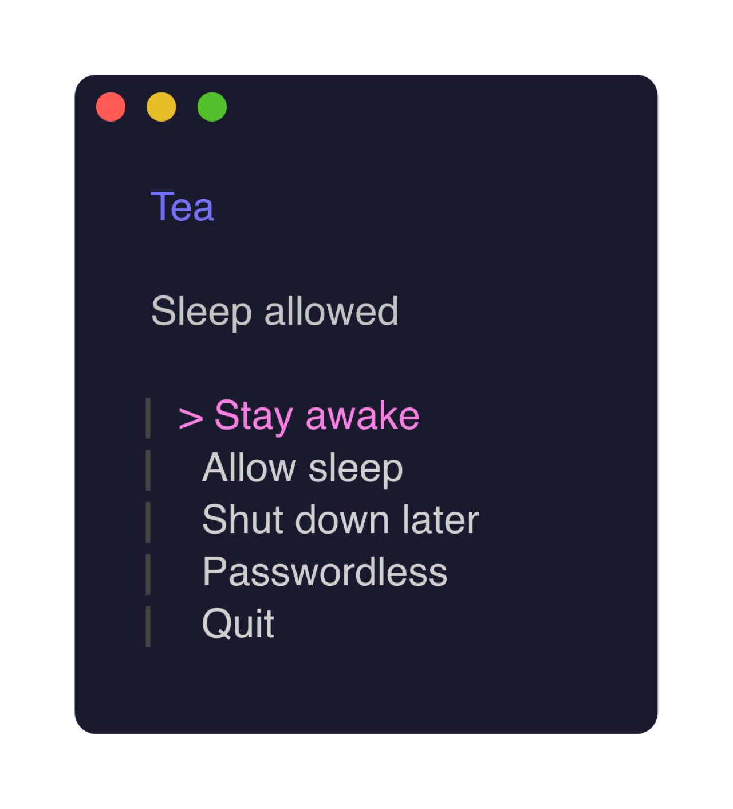

# teaway

<p align="center">
  <a href="https://github.com/soundadam/teaway/actions/workflows/ci.yml"></a>
  <a href="https://github.com/soundadam/teaway/releases/latest"></a>
  <a href="LICENSE"></a>
</p>

<p align="center"><strong>Keep a Mac awake. Restore it when you're done.</strong></p>

<p align="center">
  
</p>

```sh
brew install soundadam/tap/teaway
teaway
```

That's the client. It stays open. Keep the Mac awake — including with the lid
closed — then restore the exact sleep setting it owned.

<p align="center">
  
</p>

Need a script instead?

```sh
teaway on
teaway shutdown after 2h
teaway off
```

## Why not `caffeinate`

`caffeinate` keeps a Mac awake only while its own process runs: close the
terminal or lose the SSH session and the Mac can sleep, and closing a
MacBook's lid still sleeps it. teaway sets the system `disablesleep` value
instead, so the Mac stays up with the lid closed, on battery or AC, with
nothing left running. It records the previous value first, and `teaway off`
restores that value and nothing else. It can also schedule one delayed
shutdown and cancel exactly that one.

The name: **tea**, as opposed to caffeinate's caffeine; **away**, because
you can walk away while it runs.

macOS 13+. Don't close a MacBook in a bag.

[Product](https://soundadam.com/projects/teaway/) · [Docs](https://teaway.mintlify.app) · [Changelog](CHANGELOG.md) · [Contributing](CONTRIBUTING.md) · [Security](SECURITY.md)
